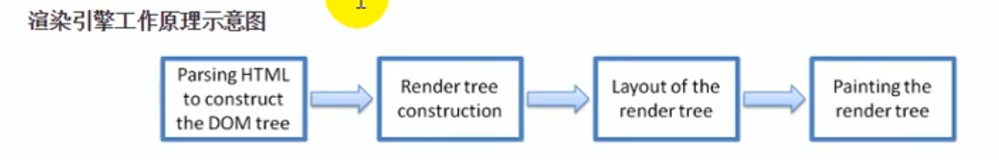
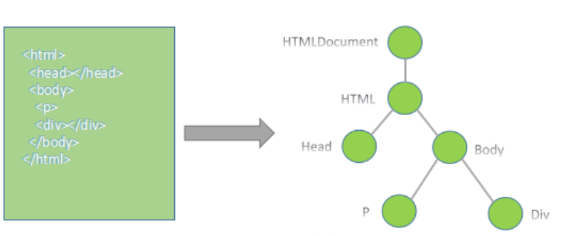
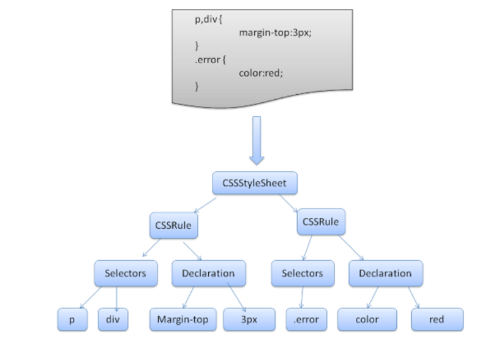
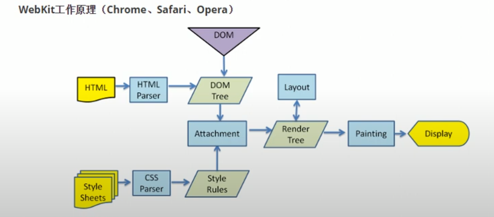
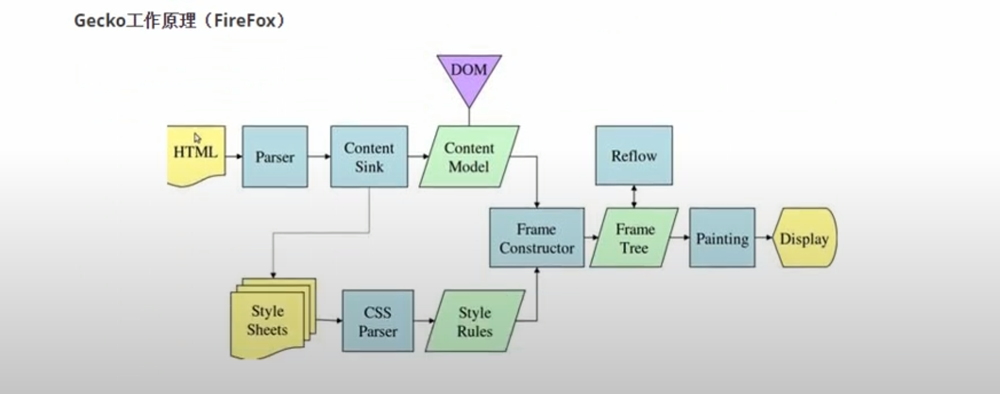

# Brower Engine



## Components

- `dom.rs` and `html_parse.rs`: HTML engine and HTML parsing.
- `css.rs` and `css_parse.rs`: CSS engine and CSS parsing.
- `style.rs`: Adds a style tree to the browser.
- `layout.rs`: Implements the Box and layout tree.
- `render.rs`: Handles rendering of the browser.
- `main.rs`: include lib.
- The files in shaders are associated with OPENGL in render.rs for rendering purposes

## Explain

This is an html parsing schematic



This is an css parsing schematic



And the following two are Google engine schematic and Firefox engine schematic



## Getting Started

To use this browser engine, follow these steps:

1. Clone the repository:

   ```shell
   git clone https://github.com/hacker1477/Browser-engine.git
   cd repository
   ```

2.Build the code using Cargo:

    cargo build

3.Run the Brower

    cargo run

## How to Contribute

We welcome your contributions! Please follow the steps below:

1.Fork the repository and clone it to your local machine.
2.Create a new branch for your development work.
3.Make the necessary changes.
4.Write test cases and ensure they run correctly.
5.Commit your code and submit a Pull Request (PR) to the original repository.
6.Thank you for considering contributing to this project! We appreciate your help.

## Contact Us

If you have any questions or suggestions, please submit an issue or send us an email at zzj01262022@163.com.

Thank you for using our services!
